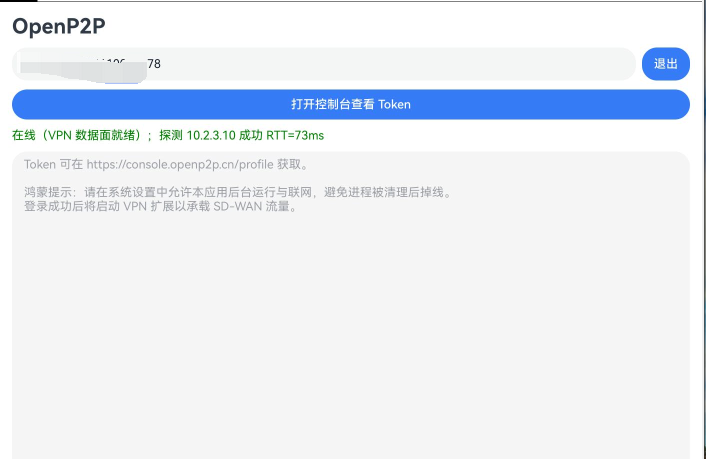
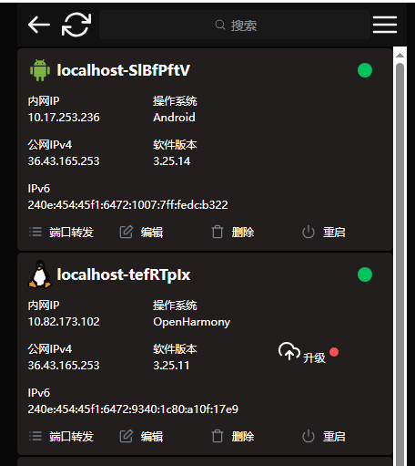

# OpenP2P for OpenHarmony / HarmonyOS

基于开源项目 [OpenP2P](https://github.com/openp2p-cn/openp2p) 的鸿蒙客户端：在 **OpenHarmony** 与 **HarmonyOS NEXT** 上登录节点、接入 P2P 网络，并通过系统 VPN 扩展承载 SD-WAN 流量。

本仓库**不是** OpenP2P 官方应用，而是社区向的 Stage 模型移植。P2P / 打洞 / 组网核心仍来自上游 Go 实现，本仓库提供 ArkTS 界面、NAPI 桥接和 `VpnExtensionAbility`。

- **OpenHarmony**：已适配。因系统自身 bug，三方 VPN 授权对话框缺失，使用前需**自行安装**仓库根目录的 [`VpnDialog.hap`](VpnDialog.hap)。
- **HarmonyOS NEXT**：源码已支持，**需自行编译** `harmonyos` 产物（本仓库不提供预编译 HarmonyOS HAP）。

[English](#english)

## 界面展示

登录后 VPN 数据面就绪（探测网关成功）：



控制台中 Android 与 OpenHarmony 节点同时在线：



## 功能

- Token 登录上游 OpenP2P 网络（可从 [控制台](https://console.openp2p.cn/profile) 获取）
- 应用内 WebView 打开控制台
- 将上游 Go 核心编译为 `libopenp2p.so`，运行时 `dlopen`，登录走异步 NAPI，避免卡住 UI
- `VpnExtensionAbility` 创建 TUN，把 SD-WAN 报文在虚拟网卡与 Go 核心之间转发
- 一份源码、两套产物：OpenHarmony API 20 与 HarmonyOS 6.0（API 20）

## 架构

```
┌──────────────────────────────────────────┐
│  ArkTS  UI（登录页 / 控制台 WebView）      │
│  OpenP2PEngine                           │
└──────────────────┬───────────────────────┘
                   │  NAPI（libentry.so）
┌──────────────────▼───────────────────────┐
│  C++ 桥：dlopen libopenp2p.so             │
│  RunAsModule / GetToken / TUN 读写 …     │
└──────────────────┬───────────────────────┘
                   │
     ┌─────────────┴──────────────┐
     ▼                            ▼
 Go 核心（上游 OpenP2P）     VpnExtensionAbility
 登录、打洞、组网            TUN fd ↔ ohosRead/Write
```

## 环境要求

| 项 | 说明 |
|----|------|
| IDE | DevEco Studio，配套 hvigor / Ohpm |
| OpenHarmony 产物 | OpenHarmony SDK **API 20**，原生编译器 BiSheng |
| HarmonyOS 产物 | HarmonyOS SDK **6.0.0(20)** |
| CPU | 目前仅 **arm64-v8a** |
| Go 核心 | 用支持 `GOOS=openharmony` 的 Go 工具链，从上游源码打出 `libopenp2p.so` |
| 权限 | 网络、获取网络信息、VPN（`ohos.permission.MANAGE_VPN`） |

真机还需在系统设置中允许联网与后台运行，否则进程被杀后会掉线。

## 获取 Go 核心库

本仓库 **NAPI 层不静态链接** `libopenp2p.so`（避免加载顺序问题），请将预编译库放到：

```text
entry/libs/arm64-v8a/libopenp2p.so
```

该 so 需导出与 `entry/src/main/cpp/napi_init.cpp` 一致的 C 符号，例如：

`RunAsModule`、`GetToken`、`NetworkConnect`、`IsOnline`、`FreeCString`、`StopModule`、`GetOhosSDWANConfig`、`OhosRead`、`OhosWrite`、`GetOhosNodeName`

实现应对齐上游 OpenP2P 的 Android/JNI 模块导出，并用 OpenHarmony Go 交叉编译为 `c-shared`。未放置 so 时应用能编过，但登录会提示 native 未就绪。

请勿把调试证书、`.p12` / `.p7b` 和个人 Token 提交进 Git。

## 安装与运行

### OpenHarmony（已适配）

因 OpenHarmony 系统 bug，设备上往往没有三方 VPN 授权界面，需要先安装本仓库附带的 `VpnDialog.hap`，再安装客户端。

```bash
hdc install VpnDialog.hap
hdc install OpenHarmony.hap
```

若你自行编译 `default` 产物，把第二步换成自己打出的 HAP 即可。`VpnDialog.hap` 仍必须先装，否则登录后 VPN 扩展无法弹出授权、TUN 建不起来。

### HarmonyOS NEXT（需自行编译）

商用鸿蒙请用 DevEco 打开本仓库，配置 HarmonyOS SDK **6.0.0(20)** 与签名，选择 Product **`harmonyos`** 后编译安装。仓库**不提供**预编译 HarmonyOS HAP。

```bash
hvigorw assembleHap -p product=harmonyos
```

HarmonyOS 一般自带 VPN 授权流程，**不必**安装 `VpnDialog.hap`。

### 从源码编译（可选）

1. 用 DevEco Studio 打开本仓库，等待 Ohpm / hvigor 同步。
2. 在 **File → Project Structure → Signing Configs** 配置调试签名（克隆后的工程不含本地签名材料）。
3. 选择 Product：
   - `default`：OpenHarmony
   - `harmonyos`：HarmonyOS NEXT（需自行编译）
4. 安装到 arm64 设备。OpenHarmony 真机请先安装 `VpnDialog.hap`。

```bash
hvigorw assembleHap -p product=default
hvigorw assembleHap -p product=harmonyos
```

两个 Product **不能**共用一个 HAP：运行时标识、设备类型（OpenHarmony 为 `default`/`tablet`，HarmonyOS 为 `phone`/`tablet`/`2in1`）和签名体系都不同。

### 使用

1. 打开应用，到 [console.openp2p.cn/profile](https://console.openp2p.cn/profile) 复制 Token（可用页内「打开控制台」）。
2. 粘贴 Token 后点登录。
3. 登录成功后会拉起 VPN 扩展以承载 SD-WAN；按系统提示授权 VPN。
4. 「退出」会停止 VPN 扩展并断开核心（软断开，不 `os.Exit`）。

## 已知限制

- **OpenHarmony 必须自行安装 `VpnDialog.hap`。** 系统缺少三方 VPN 授权对话框（OpenHarmony 自身 bug，不是本应用实现问题）。不装该 HAP 时，`VpnExtensionAbility` 无法完成授权，TUN / SD-WAN 建不起来；节点仍可能显示在线，但虚拟 IP ping 不通。请先 `hdc install VpnDialog.hap`，再安装客户端。
- **HarmonyOS 需自行编译。** 请用 DevEco 选择 `harmonyos` 产物本地签名、打包、安装；本仓库只提供源码，不提供预编译 HarmonyOS HAP。商用机对 `MANAGE_VPN` 仍可能更严，需在目标机型上验证。
- 仅打包 **arm64-v8a**。
- 老版本 HarmonyOS 2/3/4（Android 兼容层）**不能**安装本应用。
- 本客户端不包含 OpenP2P 服务端；中继与控制台仍使用上游公开网络（或你自建的网关）。

## 目录说明

```text
AppScope/                 应用名、图标、bundleName
entry/src/main/ets/       ArkTS：登录、VPN、引擎封装
entry/src/main/cpp/       NAPI 桥（libentry.so）
entry/src/harmonyos/      HarmonyOS 产物的 module 覆盖（设备类型）
entry/libs/arm64-v8a/     预编译 libopenp2p.so（需自行放入）
image/                    界面与控制台截图
OpenHarmony.hap           OpenHarmony 预编译客户端（可选）
VpnDialog.hap             OpenHarmony 系统 VPN 授权缺失的补丁 HAP（必装）
build-profile.json5       Product：default / harmonyos
```

## 开源与致谢

- 上游项目：[openp2p-cn/openp2p](https://github.com/openp2p-cn/openp2p)（MIT），官网 [openp2p.cn](https://openp2p.cn)
- 本仓库许可证：MIT（见 [LICENSE](LICENSE)）
- 禁止将本项目用于任何非法用途。因不当使用造成的损失，作者与贡献者不承担责任。

欢迎 Issue / PR：文档、新 ABI、VPN 兼容性、构建脚本等。提交前请去掉本机签名、日志和 Token。

---

## English

A community **OpenHarmony / HarmonyOS NEXT** client for [OpenP2P](https://github.com/openp2p-cn/openp2p): token login, in-app console WebView, and SD-WAN via `VpnExtensionAbility`. This is **not** an official OpenP2P app. The P2P core remains upstream Go (`libopenp2p.so`); this repo adds ArkTS UI, a NAPI `dlopen` bridge, and TUN plumbing.

**OpenHarmony is supported**, but you must install [`VpnDialog.hap`](VpnDialog.hap) first (OpenHarmony OS bug: missing third-party VPN consent UI). **HarmonyOS NEXT must be built yourself** (DevEco product `harmonyos`); this repo does not ship a prebuilt HarmonyOS HAP. Screenshots are under `image/`. Licensed under MIT. Do not use this software for illegal purposes.
